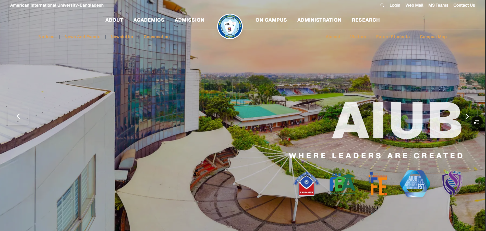
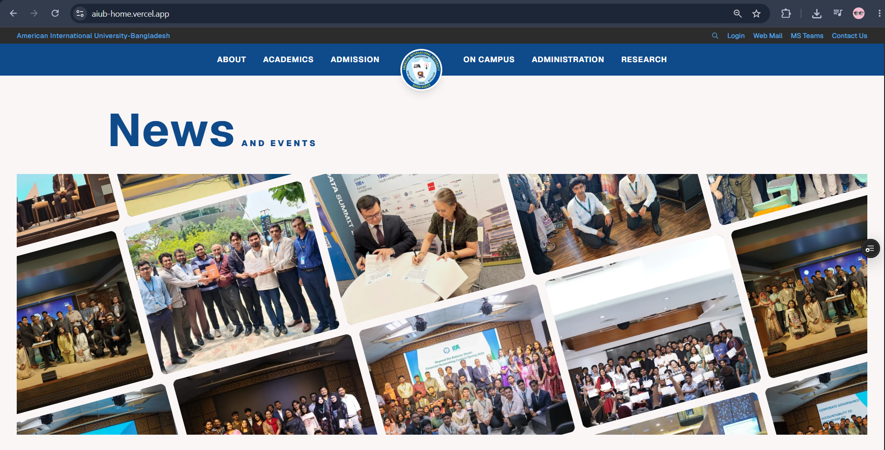

# AIUB Home

A modern, highly interactive landing page for American International University-Bangladesh (AIUB) built with cutting-edge web technologies. This project features dynamic animations, smooth scrolling, and an optimized, responsive layout.

## 🔗 Live Link

https://aiub-home.vercel.app/

## ✨ Features

- **Dynamic Hero Section**: Interactive image carousels using Swiper.
- **Animated UI Components**: Engaging hover and scroll effects built with Framer Motion.
- **Continuous Motion Grids**: Custom GSAP-powered floating grids for the News & Events section.
- **Smooth Scrolling**: Implemented globally using Lenis for a premium browsing experience.
- **Responsive Design**: Tailored layout supporting desktop, tablet, and mobile devices natively using Tailwind CSS.
- **Performance Optimized**: Uses Next.js App Router, optimized `<Image />` components, and Turbopack for lightning-fast builds.

## 📸 Screenshots

| Hero Section | News & Events |
|:---:|:---:|
|  |  |


## 🛠 Technology Stack

- **Framework**: [Next.js 16](https://nextjs.org/) (App Router)
- **Language**: [TypeScript](https://www.typescriptlang.org/)
- **Styling**: [Tailwind CSS v4](https://tailwindcss.com/)
- **Animations & Interaction**: 
  - [Framer Motion](https://www.framer.com/motion/)
  - [GSAP](https://gsap.com/)
  - [Lenis](https://lenis.studiofreight.com/)
  - [React CountUp](https://www.npmjs.com/package/react-countup)
  - [Swiper](https://swiperjs.com/)
- **Icons**: [Lucide React](https://lucide.dev/)

## 🚀 Setup Instructions

Follow these steps to run the project locally on your machine.

### Prerequisites

Ensure you have Node.js (v20 or higher) installed.

### Installation

1. **Clone the repository:**
   ```bash
   git clone https://github.com/MostofaSeum/AiubHome.git
   cd aiubhome
   ```

2. **Install dependencies:**
   ```bash
   npm install
   # or
   yarn install
   # or
   pnpm install
   ```

3. **Run the development server:**
   ```bash
   npm run dev
   ```

4. **Open the app:**
   Open [http://localhost:3000](http://localhost:3000) with your browser to view the application.

## 👤 Author & Developer

**Mostofa Seum**
- Role: Solo Developer & Designer
- Contributions: Built the entire application independently, including architecture setup, UI/UX design, animations (Framer Motion, GSAP, Lenis), component development, and performance optimization.
- GitHub: [@MostofaSeum](https://github.com/MostofaSeum)
---
*This project was bootstrapped with [`create-next-app`](https://nextjs.org/docs/app/api-reference/cli/create-next-app).*
